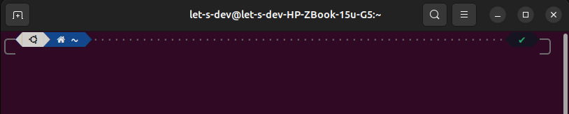
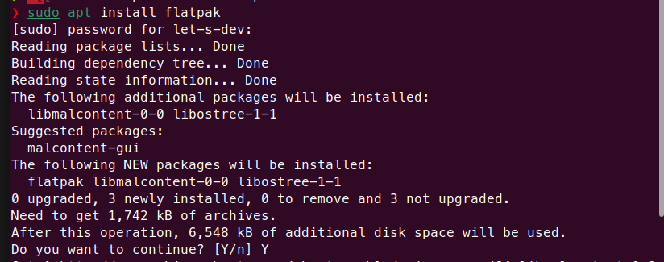
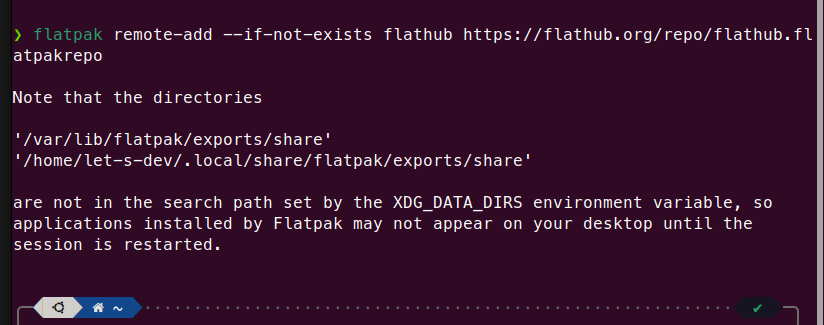
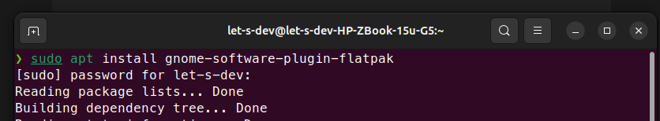
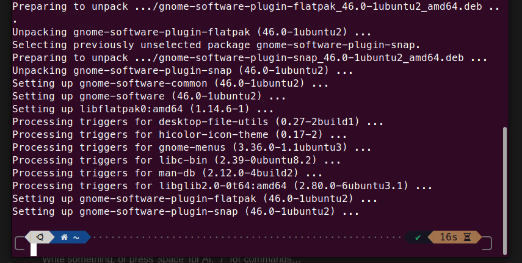
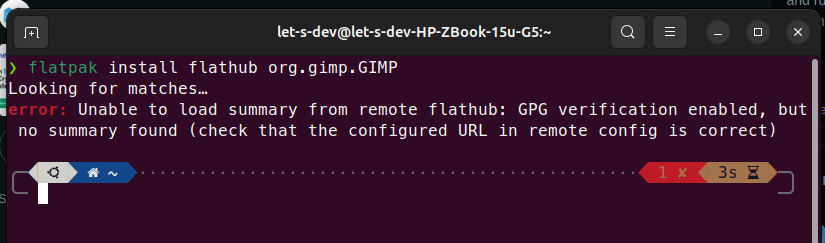

Flatpak is another software packaging system that offers self-contained application bundles. Mostly these bundles have all the peer dependencies for the specific package. It is a more one-liner solution just like Snapcraft. It also has a vast repository of applications.

## Installing Flatpak

### Step 1: Open the terminal

Open the terminal using the quick command _CTRL + ALT + A._



### Step 2: Install flatpak

Run the following command. Enter your password when prompted. This will download and install the necessary Flatpak packages.

```bash
sudo apt install flatpak
```

Write Y and press Enter



### Step 3: Enable flatpak

We have installed Flatpak but access to the repository is not available right now, to make Flatpak functional, run the following command;

```bash
flatpak remote-add --if-not-exists flathub https://flathub.org/repo/flathub.flatpakrepo
```



**Now we need to restart our computer.**

### Step 3: Software Flatpak Plugin

Last step is to install Software Flatpak plugin

```bash
sudo apt install gnome-software-plugin-flatpak
```

**Start:**



**Final:**



### Step 4: Optional

Some users may face following error. It is due to repository of packages was not correctly added.

**Problem**



**Let's fix the problem, use following command**

It will ask you for password 2 times, provide that.

```bash
flatpak remote-delete --force flathub
flatpak remote-add --if-not-exists flathub https://flathub.org/repo/flathub.flatpakrepo
```

## Time to test

Let's test it by installing something. I have to install ksnip.

```bash
flatpak install flathub org.ksnip.ksnip
```

Installed…


