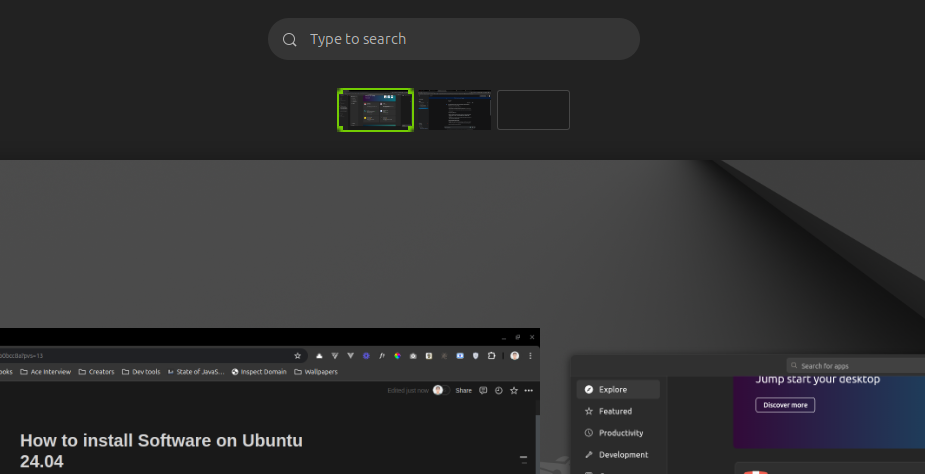
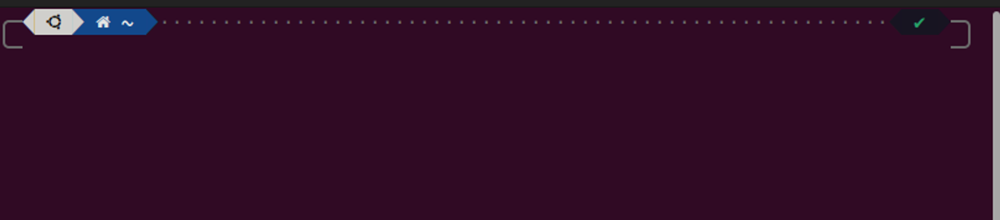
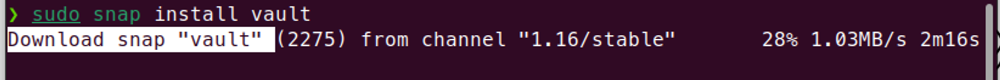

Hi in this article I'll explain how to install software on Ubuntu 24.04. In Windows or Mac, software installation is not difficult; it is seamless but rough in Linux and Unix operating systems. But I'll make it easy. 

There are various ways to install Software and packages in Ubuntu. 

1. Using GUI Tools
2. Using Package managers 
3. Using Flatpak
4. Manual Installation

## Using GUI tools

It is the Ubuntu Software Center, and the new name is App Center. Installing Software using App Center is the simplest way for beginners from Windows especially. Okay, so how does it work, 

### Step 1:

Press the Super key or click on the right top corner of the screen, 



### Step 2:

Search *App Center.* 

Search your favorite Software in from the search bar. 

## Using Package manager

There are multiple package managers for Ubuntu but I'll discuss 2 in this section *apt,* and *snap. apt* is the default one comes along the installation. Here is the usage,

### Step 1:

Open the terminal using CTRL + ALT + A  



### Step 2:

Install the package. The structure is *sudo apt install <package_name>, eg;*

```bash
sudo apt install flameshot  
```


And yay!!!


### Using snapd

Same procedure but using *snapd.*  I can install any package from snapcraft io store using this command. Snapcraft is an official package store by canonical. It is the 2nd most easy way to install packages in Ubuntu 24.04. eg;


Let's install Vault, I have not used Vault by the way. Let's install it and explore. 

**Command**: *sudo snap install <package_name>*

```bash
sudo snap install vault
```




## Using Flatpak

Make sure have installed the Flatpak on your system. You can find a detailed guide in my previous article.

For example, I have to install GIMP, I can use the following command;

```bash
flatpak install flathub org.gimp.GIMP
```


## Manual Installation

It is manual and rough, but flexible too for power Linux users. There are further two ways;

- Using dpkg
- Using tar

### Using dpkg

Used to install downloaded .deb packages. But make sure they are the latest and correctly downloaded. Here's the breakdown

**sudo:** full root access 

**dpkg -i:** to extract and install the binaries into the system

**location/path:** Location or path of the .*deb*  file

After summing up, the command should be following

```bash
sudo dpkg -i <package_name.deb>
```

- Packages ended with .deb
- They should be the latest and correct deb packages
- The source of downloading should be authentic, as a security measure

A valid deb file and terminal with root access are required; I have downloaded Zoom already in .deb format. It's a valid deb file. So

```bash
cd Downloads
```

```bash
sudo dpkg -i zoom_amd64.deb
```

- Run it
- May ask for the password: provide your system password for the root user
- May ask for permission: enter Y and press Enter

That's all and here is my result;

### Using Tar/Untar

I found it the most complex option to install Software on Ubuntu 24.04. I usually avoid it. But sometimes I need to do it, so how I do it; 

### Step 1: Download Software

Download the file available usually on the Software homepage or GitHub release page in tar.gz format. Choose a destination upon downloading, Downloads directory is usually a location.  

I have downloaded Obsidian in tar.gz format. Let's extract in the next step. 

### Step 2: Extract archive

Open a terminal window (Ctrl+Alt+T). Navigate to the directory containing the downloaded archive using the *cd* command. For example, if it's in Downloads, type;

```bash
cd Downloads
```

```bash
tar -xf <archive_name.tar.gz>
```

**Example;**

Confirm the existence of the package. One way is, I am already in Downloads

```bash
ls -lta
```


**Extracting it**

```bash
tar -xf obsidian-1.5.12-arm64.tar.gz 
```

### Step 3: Running the software

Enter the extracted folder, like this. And locate the file highlighted (obsidian)


Make it executable. Using

```bash
chmod +x ./obsidian
```

Then run it by running

```bash
./obsidian
```


And it'll open the program. 

It was a bit complicated but interesting too. Usually, this format is usable for a single run. Because by default it doesn't add the Software to Applications. 

## Choosing the Right Method

Hmm! The question is valid and the answer needs to be simple. Okay, it depends on the Software and person-to-person. 

- For most of the users, Ubuntu App Center is the go-to option.
- But some people like the terminal way,  they are very fluent with commands. And using commands we can see the logs if there's anything go wrong I can see and find the fix
- Snap and Flatpaks are single command solutions in easy to complex rating it is 2nd option.
- Manual installation is the most complex one especially the tar.gz one. And most of the time they need some peer dependencies to run software properly.

My favorite ones are dpkg, and snap. I don't like flatpak personally but it is similar to snapcraft. Tell me what's your favorite.
