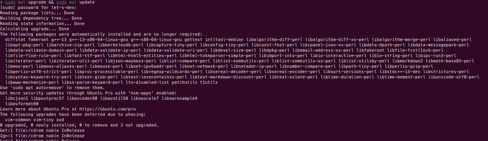
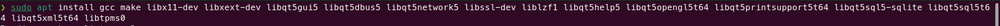
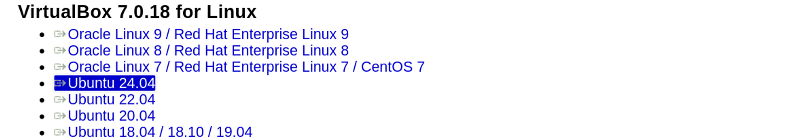
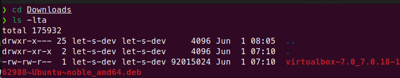
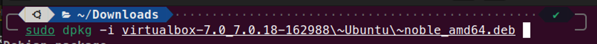
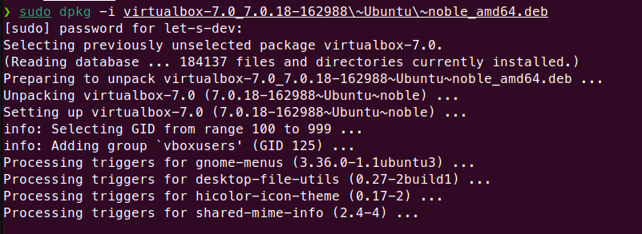
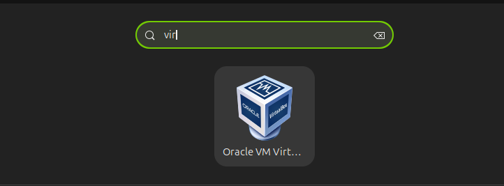

**VirtualBox** is a software program that lets you run multiple operating systems on a single computer. It's a type of software called a **hosted hypervisor**. It allows us to create Virtual Machines (VMs). Each VM is a separate computer with its operating system but with shared resources from our Physical system. Depending on Computer / Laptop resources multiple VMs can be created with different Operating Systems for each on the same machine.

## VMware Workstation & Usage

From running multiple operating systems to managing them, allocating resources, and allowing complex network configuration VMware does all these things. For whom VMware works perfectly are;

- **IT professionals** use it for testing, development, and deploying the Software. eg; VPS
- **Developers** use it to create an isolated development environment, eg; CodeSandBox, Blitz
- **Educators** use it to teach, and students use it to explore different Operating systems.

As I have discussed how virtual machine makes our work easy. Do you need it on your Laptop / Computer? Let's do it.

There are initial system requirements and a few steps to install **VirtualBox** on Ubuntu 24.04.

## Prerequisites

- A laptop/computer running on Ubuntu must be 64-bit
- Access to root user
- A terminal
- Minimum 2 GB of RAM, recommended 4GB or more
- Enough free disk space to accommodate the software itself. and VMs. 40 to 60 GB
- A 64-bit processor with virtualization technology enabled, dual or higher is better.
- Better internet connection

Before I begin, I need to install a few peer dependencies and update our system.

### Update the System Packages

Update the system using the following command.

```bash
sudo apt upgrade && sudo apt update
```



### Installing Peer Dependencies

```bash
sudo apt install gcc make libx11-dev libxext-dev libqt5gui5 libqt5dbus5 libqt5network5 libssl-dev liblzf1 libqt5help5 libqt5opengl5t64 libqt5printsupport5t64 libqt5sql5-sqlite libqt5sql5t64 libqt5xml5t64 libtpms0
```




Okay, alright. It's time to move forward to our actual installation.

## Installing VirtualBox

Okay, so the initial step is downloading **VirtualBox** from their official website. Use [direct link](https://www.virtualbox.org/wiki/Linux_Downloads).



### Step 1: Open the Terminal

Open the terminal using the command _CTRL+ALT+A._

Update the system, again, yes, I have installed the peer dependencies therefore I need to update the system again.

```bash
sudo apt update
```

Change the directory using the following command.

```bash
cd Downloads

ls -lta
```



### Step 2: Installing

After locating the _deb_ file, now install it. Use the following command to install it.

**sudo:** full root access

**dpkg -i:** to extract and install the binaries into the system

**location/path:** Location or path of the ._deb_ file

After summing up, the command should be following

```bash
sudo dpkg -i virtualbox-7.0_7.0.18-162988\~Ubuntu\~noble_amd64.deb
```



**Hit enter** and see the magic. And boom!!!.



### Step 3: Open VirtualBox and Enjoy



I have explained how to install Oracle VM VirtualBox. Normally the flow goes as I did, but exceptions are there, _deb_ file may break so always install the latest one. Sometimes you may face an error on step 2, you better restart your system can fix the problem.

By the way, I enjoyed exploring this topic, I was stuck too, yes, I had to uninstall Virtualbox, I had to remove everything then I installed it again. I hope it is easy for you as I explained it in step by step.
