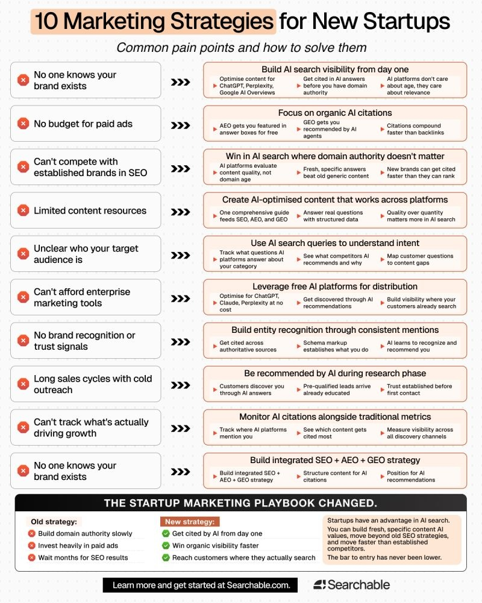

I wanted to start this by saying something you probably need to hear. You aren't behind. It just feels that way because the "rules" of marketing are shifting under our feet.

If you look at how people find products today, it's not just about Google's ten blue links anymore. We're in the middle of a massive pivot toward AI search. If you're a new startup, you actually have an advantage here. You don't have to defend an old, dusty SEO strategy. You can build for 2026 from day one.

## The End of "Domain Authority" as a Barrier

For years, the biggest problem for startups was that no one knew their brand existed. You couldn't compete with the giants because they had "domain authority." They had been around for 20 years, so they owned the search results.

In the new world of AEO (Answer Engine Optimization) and GEO (Generative Engine Optimization), that barrier is falling. AI platforms like ChatGPT, Perplexity, and Claude don't care about how old your domain is. They care about relevance.

If you provide a specific, high-quality answer to a real question, the AI will cite you. It evaluates the content quality right now, not your history from a decade ago. This is how you win in AI search without a million-dollar budget.

## Solving the "No Budget" Problem

Most startups don't have the cash for massive paid ad campaigns. The solution used to be "wait six months for SEO to kick in." That's too slow.

The new strategy is focusing on **organic AI citations**.

- **AEO** gets you featured in those "Answer Boxes" at the top of the screen.
- **GEO** ensures that when an AI agent is researching a topic for a user, your brand is the one it recommends.

Citations compound faster than backlinks ever did. Instead of begging for links, you focus on becoming an "entity" that the AI recognizes as a trusted source of truth.

## Content That Actually Works Across Platforms

A lot of founders feel overwhelmed because they have "limited content resources." They think they need to be everywhere at once.

The reality is that one comprehensive, well-structured guide can feed your entire strategy. If you answer real customer questions using structured data (schema markup), the AI can "read" your site easily. It understands what you do and who you serve.

Stop writing generic blog posts for keywords. Start building entity recognition. When you are mentioned consistently across authoritative sources, the AI learns to recognize and recommend you. It's about being the most useful, not the most frequent.

## Understanding Intent Through AI

If you aren't sure who your target audience is, look at the AI search queries. Track what questions AI platforms are answering about your category. See what they recommend and, more importantly, _why_ they recommend it. This reveals the "content gaps" that your competitors are missing.

You don't need expensive enterprise tools for this. You can leverage the free versions of Claude or Perplexity to understand the distribution landscape. Use them to see where your customers are already searching and build visibility right in their path.

## Shortening the Sales Cycle

The old way of cold outreach is a grind. It leads to long, painful sales cycles. When you are recommended by an AI during a user's research phase, the trust is established before they ever talk to you. The lead arrives already educated. They've already seen your brand cited as a solution. This changes the dynamic from "selling" to "onboarding."

## The Mental Shift: Stop Treating News Like Homework

There is a lot of noise out there. Every Monday there is a new "game-changing" tool. My advice? Stop treating every tech update like required homework. You don't need to master every single new AI feature by Tuesday.

The startups that win in 2026 will be the ones that:

1.  Build fresh, specific content that AI values.
2.  Move faster than the established brands who are stuck defending old strategies.
3.  Focus on being cited, not just being "on top" of a list.

The bar to entry has never been lower. You aren't failing because you didn't try a tool that dropped two weeks ago. You're winning if you're building something of substance that actually solves a problem.

Focus on the fundamentals of your tech stack, keep your content specific, and let the AI do the heavy lifting of discovery. You've got this.
