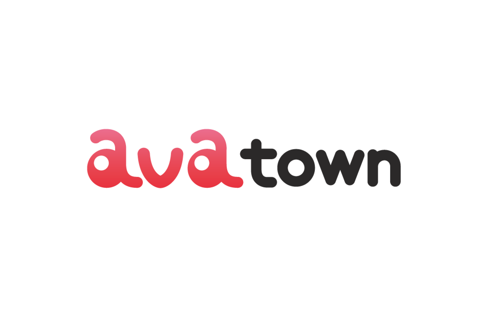

<a href="https://goavatown.com" target="_blank">Visit Avatown</a>

**Project Overview:**
I joined Dolamni Inc. in 2023 as a founding engineer. On May 6, 2023, I started building Avatown from scratch. Zero pages, zero users, just an idea. This marketplace would let people buy and sell virtual avatars across different platforms.

## Technical Decisions (The Hard Way)

**Initial Stack:**

- Next.js 13 with App Router
- Material UI (MUI)
- Tailwind CSS
- Atomic Design Pattern
- Server Components

**The Reality:**
We spent 8 months to launch beta. Three developers. Eight months for a beta. Why?

- MUI was difficult to customize
- Atomic Design created a rigid system
- Next.js 13 App Router had a steep learning curve
- We were learning while building

Eight months of mistakes taught us what not to do.

## The Transition

After beta, I asked for a senior frontend engineer. The company hired one, and he changed everything. He showed me how shallow my understanding was, how many wrong choices I'd made. I'm grateful for that.

**What Changed:**

1. **Server Functions → React Query**
   - I resisted this at first
   - Now I understand why it works better

2. **MUI → shadcn/ui + Full Tailwind**
   - Removed the `av` prefix mess
   - Much faster to work with

3. **Killed Atomic Design**
   - Too rigid for our needs
   - Slowed us down more than it helped

4. **New Project Architecture**
   - Designed together with the team
   - Actually makes sense for our workflow

5. **i18n Integration**
   - Started before the senior engineer joined
   - Completed during the transition

## Results

**Performance:**

- Development speed increased by 50%
- Project performance improved by 40%
- Developer experience improved by 30%

The new stack made everything faster. Writing code felt easier. Shipping features took less time.

## What I Learned

Sometimes you need someone to tell you you're wrong. The senior engineer didn't just criticize. He showed me better ways to build.

I spent 8 months doing things the hard way. The next phase took half the time and produced better results. That's the difference experience makes.

Now I know: Atomic Design isn't always the answer. MUI isn't always worth the customization pain. And being wrong early is better than being wrong late.
